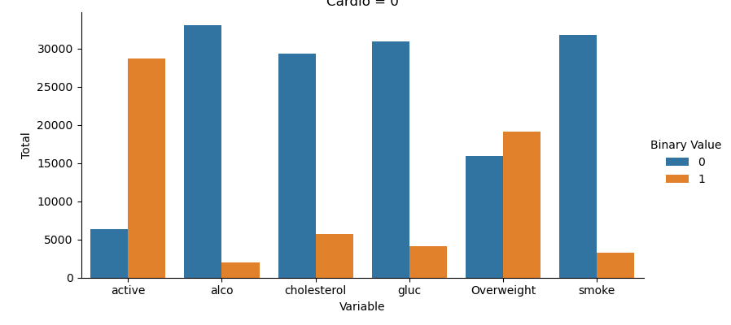
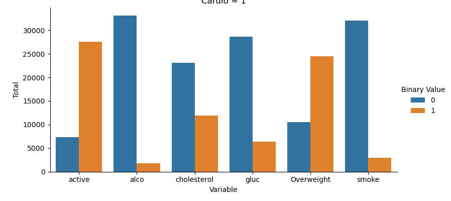

# **🏥Medical Examination Data Analysis**

## **📄Description:**

This project analyzes medical examination data using the Pandas library and visualizations are represented in the form of grouped-bar chart and heatmap using Matplotlib and Seaborn library respectively.

The dataset used in this project contains values that were collected during a medical examination. Also, the dataset will be used to explore the relation between cardiac disease, body measurements, results from various blood tests and lifestyle choices.

## **📑Dataset Overview:**
The dataset is structured as follows:

● Project approach:Rows represent individual patients.

● Columns represent a wide range of info including body
measurements, results from various blood tests and 
lifestyle choices.

## **🚀Project approach:**

♦ Normalizing the dataset columns values as “0 representing a positive state” and “1 representing a negative state”. As the values range from 0 to 3. Normalization will help with the visualization of the dataset.

♦ Splitting the dataset into 0 and 1 of a column named “cardio” (cardiovascular disease) for displaying the visualization in the form of a grouped Bar chart. It will give the relation between blood test results and lifestyle choices for people not having the disease (0) and having the disease (1).

♦ After some sorting around height and weight, plotting a Heatmap using Seaborn and masking the upper triangle using numpy. Before that,  a correlation matrix should be made for a heatmap showing the relation between variables/columns.

## **👨‍⚕️️Health Insights:**

After some exploration and analysis of the dataset, uncovering some valuable insights using visualization.

➡Here the binary values (0) and (1) represents Yes/No in terms of the number of patients.

◾️Cardio = 0 (People not having cardiovascular disease)

◾️Cardio = 1 (People not having cardiovascular disease)

➡ Here the Heatmap shows the relation between the columns of the dataset.

(For the Heatmap, a correlation matrix is created first)

## **📃Data Source:**

The dataset used in this project is sourced from a real-time medical examination.
